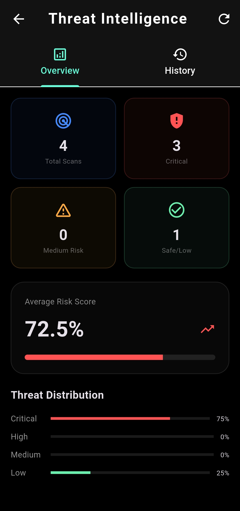
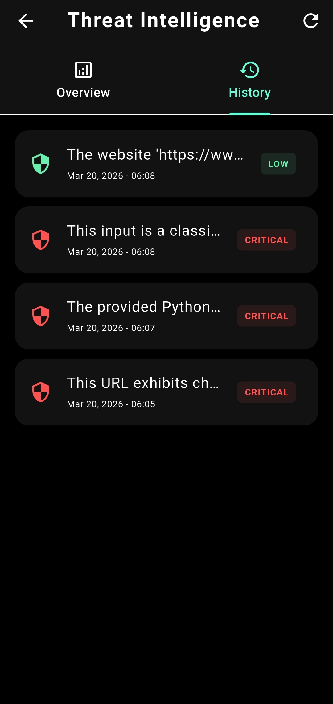
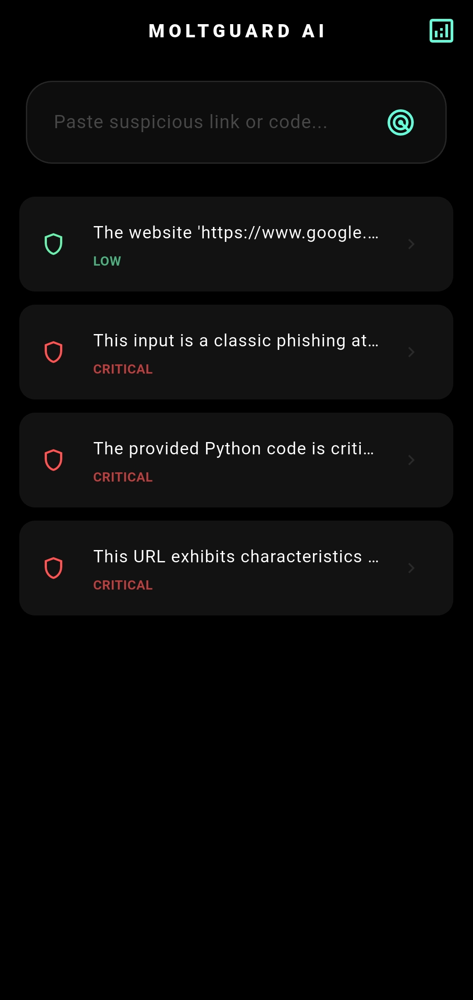

# 🛡️ MoltGuard: AI Security Orchestrator

[](https://flutter.dev)
[](https://ai.google.dev)
[](https://opensource.org/licenses/MIT)

If you find this project useful, please consider giving it a ⭐ to support its development!

**MoltGuard** is a cutting-edge mobile security orchestrator powered by the next-generation **Gemini 2.5 Flash**. It performs high-speed behavioral auditing on AI interactions to detect prompt injections, malware patterns, and data leaks with unprecedented reasoning capabilities.

## 🚀 Key Features (Powered by Gemini 2.5 Flash)
* **Extreme Reasoning Speed:** Leveraging the ultra-fast **Gemini 2.5 Flash** for real-time threat analysis without latency.
* **Lux Loading Radar:** A premium security scanning animation for an immersive "Cybersecurity" experience.
* **Smart Risk Classification:** Internal logic that auto-calculates threat levels (Critical, High, Medium, Low) ensuring no "Unknown" results.
* **Professional PDF Audits:** Generate detailed security reports with **QR Code verification**, powered by deep AI insights.
* **Modular Clean Architecture:** Organized into a professional **Service Layer** (Models, Services, Screens) for enterprise scalability.

## 📸 Preview
<p align="center">
  
  
  
</p>

<p align="center">
  
  
</p>

*MoltGuard in action: Real-time auditing and professional reporting powered by Gemini 2.5 Flash.*

## 📂 Project Structure
```text
lib/
├── models/      # Data Structures & Smart Fallback Logic
├── services/    # AI Service (Gemini 2.5), Export (PDF), & Storage
├── screens/     # Premium UI Components
└── main.dart    # Application entry point
```

## 🗺️ Future Roadmap
We have ambitious plans for MoltGuard! From on-device ML to enterprise-grade security monitoring. 
🚀 **[View our detailed Roadmap here](ROADMAP.md)**

---

## 🛠️ Built With
* **[Flutter](https://flutter.dev)** - High-performance core cross-platform framework.
* **[Gemini 2.5 Flash](https://ai.google.dev)** - Utilizing the next generation of AI for advanced safety auditing.
* **[FlutLab](https://flutlab.io)** - Professional cloud IDE used for rapid development and orchestration.
* **[MIT License](LICENSE)** - Open for community contribution and safety research.

---

## ⚠️ Disclaimer
*This tool is for educational and research purposes only. Always use AI responsibly and ensure you comply with data privacy regulations.*

---

> **Note:** This project showcases the cutting-edge application of **Gemini 2.5 Flash** in the field of AI safety and mobile security guardrails. It aims to empower users with a transparent layer of protection in an AI-driven world.
